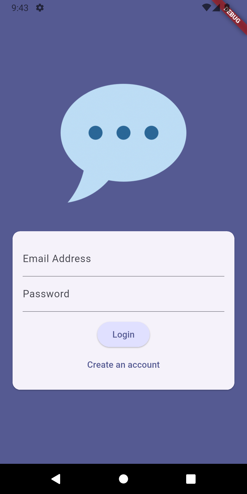
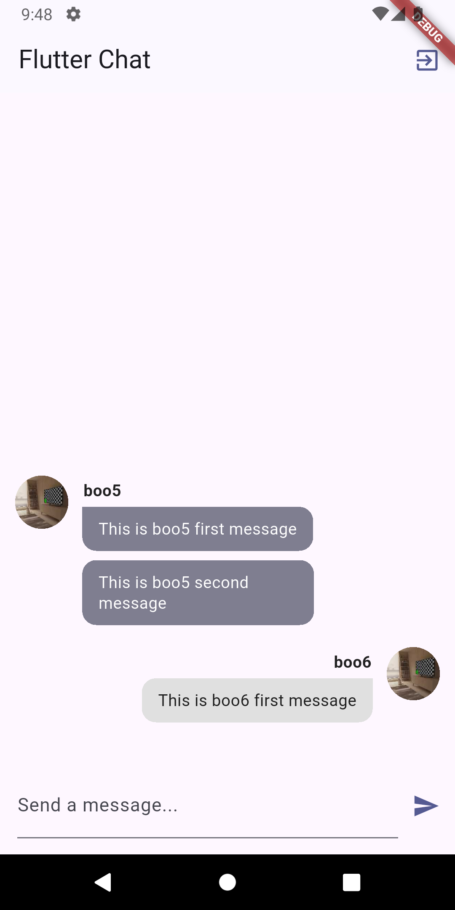

# chat_app

A Flutter Chat application project that uses Firebase Auth, Storage and Database as well as Push Notifications.   This is for practicing how to use
Google Firebase and how it works.

## Getting Started

This project is an application allowing you to sign in or create an account, add an image for a user and use a chat flutter application using push notifications.   It uses Firebase.

This is part of the Flutter Complete course but since it was outdated - these files have been updated for using latest flutter version and packages.

This project uses Firebase Auth, Firebase Storage and Firebase Database as examples of how to use.   

## Screenshots

### Login Screen

### Chat Screen

## Features

- User authentication (sign up, login)
- Real-time chat
- Image upload for user profiles
- Push notifications

## Technologies Used

- Flutter
- Firebase Authentication
- Firebase Cloud Firestore
- Firebase Storage 
- Firebase Cloud Messaging (for push notifications)
